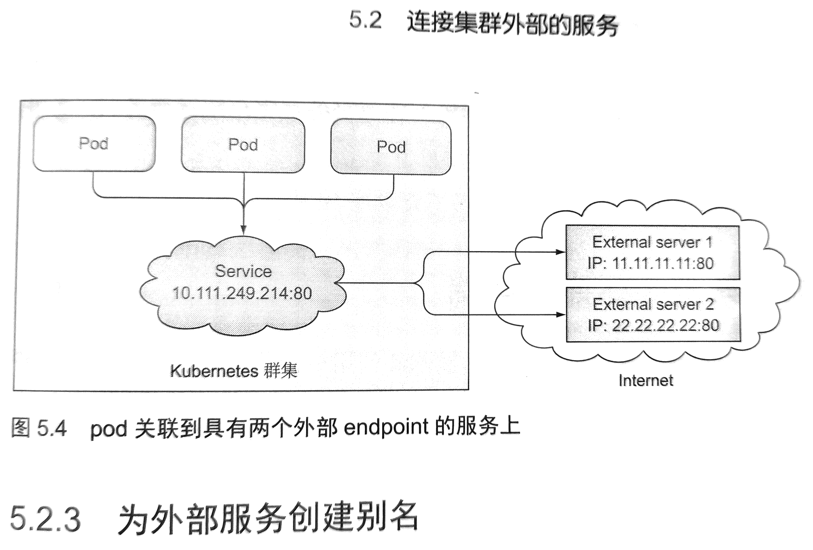

## What's Endpoint
* Service和Pod 并没有直接相连。
* Service和Pod 之间还有个Endpoint资源
* Endpoint 就是 Pod暴露服务的IP和port的对应关系。
* 在service的spec中的确定义了 labels selector，但是service并不会直接连接pods 上暴露的port。而是使用了Endpoint列表
* 如果创建了一个service且不包含pod selector，则需要手动创建Endpoint资源。（如果有pod selector，Endpoint默认会自动创建的）
* 这里其实可以创建external service。

### 关于服务/外部服务的问题
  * external  service可以利用k8s的负载均衡和服务发现功能
  * external service不包含nodeselector，创建service之后直接创建Endpoint来指定地址和port的信息。
  
```bash
[root@docker-host0 kube]# kubectl get ep
NAME         ENDPOINTS                                          AGE
kubernetes   192.168.99.103:8443                                5h53m
kubia        172.17.0.10:8080,172.17.0.8:8080,172.17.0.9:8080   107m

[root@docker-host0 kube]# kubectl describe svc kubia
Name:              kubia
Namespace:         default
Labels:            <none>
Annotations:       <none>
Selector:          app=kubia
Type:              ClusterIP
IP:                10.110.84.76
Port:              <unset>  80/TCP
TargetPort:        8080/TCP
Endpoints:         172.17.0.10:8080,172.17.0.8:8080,172.17.0.9:8080
Session Affinity:  None
Events:            <none>
```
## 手动创建Endpoint
```yaml
apiVersion: v1
kind: Endpoints
metadata:
  name: external-service        #<<< 这里的名字必须和service一样，才能彼此关联
subsets:
  - addresses:
    - ip: 11.11.11.11
    - ip: 22.22.22.22
    ports:
    - port: 80 
```
* 为了方便内部Pod访问外部服务，完全可以在k8s中创建一个服务，关联Endpoint来暴露外部服务
* 效果图如下所示：

### Endpoint和service如何关联？
* endpoint 的 name必须和service相同，彼此才能关联。
* 默认情况下service会自动创建一个同名的Endpoint来映射服务和pod的ip port。

## 为外部服务创建别名（CNAME DNS）
### 需求
* 例如公网有一个api server 地址为： api.example.com
* Pods可能会使用这个api server
* Pods使用这个api server的时候希望使用内部domain(hostname)进行访问
### 原理
* 在k8s的内部dns服务中，添加了一条指向外部服务的cname记录
* 例如映射 external-api-server到 api.example.com上

### yaml example:
```yaml
apiVersion: v1
kind: Service
metadata:
  name: external-api-server
spec:
  type: ExternalName            #<<< 这里是关键字，默认情况下 service type是ClusterIP，因为会有selector和Endpoint
  externalName: api.example.com
  ports:
  - port: 80
```
### 效果
* 这时候，Pods可以像使用内部service一样使用这个external service
* 方便了后续的api地址修改或者替换。
* 默认情况下