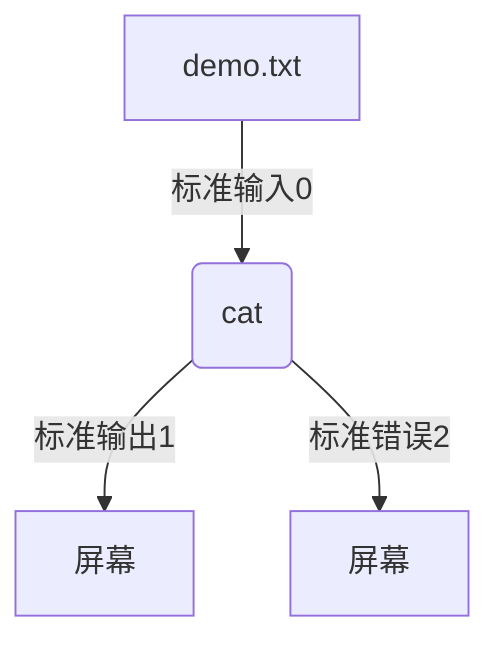
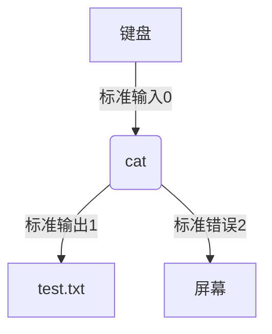
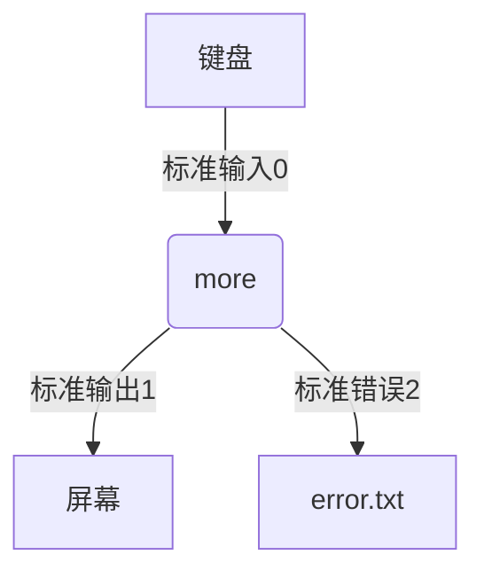

## Shell 重定向
输出 输入 错误  以及各种重定向

* * *

### 输入 输出 重定向
#### overview 标准 输入/输出/错误
 - 0 标准输入 默认 键盘 为 标准输入 // stdin
 - 1 标准输出 默认 屏幕 为 标准输出 // stdout
 - 2 标准错误 默认 屏幕 为 标准错误 // stderr

### 标准 输入
 - 默认的输入方式
 - 数字0来表示标准输入
 - 别名 stdin
 - 默认设备是键盘
 - 重定向操作符是 “<”



输入演示：
```
[root@host1-docker tmpdir]#cat < demo.txt 
line1a line1b line1c
line2a line2b line2c
line3a line3b line3c
line4a line4b line4c
line5a line5b line5c
```

### 标准 输出
 - 默认的输出方式
 - 数字1表示标准输出
 - 别名sdtout
 - 默认设备是屏幕
 - 重定向操作符“>”

**演示输出：**
以下演示，相当于：
`ls -lha 1> test.txt`
标准输出会重定向。
```
[root@host1-docker tmpdir]#ls -lha > test.txt
[root@host1-docker tmpdir]#cat test.txt 
total 96K
drwxr-xr-x 2 root root 4.0K Dec  4 14:03 ./
drwxr-xr-x 3 root root  109 Nov 22 13:47 ../
-rwxr--r-- 1 root root  199 Nov 26 14:49 checkpass.sh*
-rwxr--r-- 1 root root  105 Dec  4 13:09 demo.txt*
-rwxr--r-- 1 root root   65 Dec  2 21:08 echo.sh*
```

### 标准 错误
 - 默认的错误输出方式
 - 数字2表示标准错误
 - 别名sdterr
 - 默认设备是屏幕
 - 重定向操作符和标准输出一样，也是“>”



**演示输出：**
以下演示，相当于：
`more 1.txt 2>error.txt`

```
[root@host1-docker tmpdir]#more 1.txt
1.txt: No such file or directory
[root@host1-docker tmpdir]#more 1.txt 2> error.txt
[root@host1-docker tmpdir]#more error.txt 
1.txt: No such file or directory
```

### 重定向原理分析
操作符>在命令的使用中，改变了 `文件描述` 的输出指向。
正常情况下，默认输出和错误  都指向的 sdtout和sdterr。
但是操作符改变了`文件描述` 的输出位置，比如将**标准输出** 的位置改到了一个文件，即为标准输出重定向。
再或者，修改了**标准错误** 的位置，即为标准错误重定向。可以是文件，也可以是任何地方。
**另外：**
举例`echo "test" > 1.txt` 
默认情况下bash并不知道1.txt是否存在。
只是单纯的尝试打开这个文件，如果这个文件存在，则清空文件。等待写入。
如果这个文件不存在，则创建一个空文件。等待写入。（以便文件描述的输出位置指向这个文件）

```
[root@host1-docker tmpdir]#more null.txt > nu.txt
null.txt: No such file or directory
[root@host1-docker tmpdir]#ls nu.txt 
nu.txt
[root@host1-docker tmpdir]#more nu.txt 
[root@host1-docker tmpdir]#
```

### 重定向 整个重定向的输出

在循环上重定向。循环中所有的stderr都做重定向。
注：这里使用了双重重定向，避免每次重定向时，文件被清空。

```
#!/bin/bash -
for dir in $@
do
        find / -name "*.tmp" --exec rm -rf {} \;
done 2>>error.log
```
### 文件的逐行处理

```
#!/bin/bash -
[ $# -ne 1 ] && echo "Please use `basename $0` FILENAME" && exit 1

filename=$1

sqn=0

while read line
do
	let sqn++
	echo "$sqn $line"
done < $filename

echo -e "\n Total $sqn lines read."

exit 0
```

### 从标准输入读取输入内容 
常用与 grep sed tr 这种过滤程序
#### **here-documents**
```
#!/bin/bash -
tr a-z A-Z <<EOF
        aaa bbb ccc
        ddd eee fff
EOF

tr a-z A-Z <<-EOF
        aaa bbb ccc
        ddd eee fff
EOF
```

#### **here-strings**
```
[root@host1-docker tmpdir]#tr a-z A-Z <<< "aaa bbb ccc"
AAA BBB CCC
[root@host1-docker tmpdir]#tr a-z A-Z <<< aaa
AAA
```

```
[root@host1-docker tmpdir]#tr a-z A-Z <<< "aaa bbb ccc
> ddd eee fff"
AAA BBB CCC
DDD EEE FFF
```

### 创建一个空文件
```
[root@host1-docker tmpdir]#>testNullfile
[root@host1-docker tmpdir]#ls -lh testN*
-rw-r--r-- 1 root root 0 Dec  6 15:45 testNullfile
```
### 丢弃 /dev/null 的几种用法

重定向标准输出1 到 /dev/null
```
[root@host1-docker tmpdir]#more /etc/passwd > /dev/null
[root@host1-docker tmpdir]#more /etc/passwd 1> /dev/null
```
重定向标准错误 到 /dev/null
```
[root@host1-docker tmpdir]#more test
test: No such file or directory
[root@host1-docker tmpdir]#more test 2> /dev/null 
[root@host1-docker tmpdir]#
```

### 与 && 和 || 一同使用
重定向 标准输入 和 标准输出
```
command &> /dev/null
command >& /dev/null
command 2>&1 > /dev/null
command  >  /dev/null 2>&1
```

```
[root@host1-docker tmpdir]#grep root /etc/passwd &> /dev/null && echo 'Yes.' || echo 'No!!'
Yes.

[root@host1-docker tmpdir]#grep test /etc/passwd &> /dev/null && echo "Yes." || echo 'No!!'
No!!
```

### 重定向 追加
```
[root@host1-docker tmpdir]#more test 2>>err.log

[root@host1-docker tmpdir]#more err.log 
test: No such file or directory

[root@host1-docker tmpdir]#more foo 2>>err.log

[root@host1-docker tmpdir]#more err.log 
test: No such file or directory
foo: No such file or directory
[root@host1-docker tmpdir]#
```

### 执行其他脚本时 进行重定向 可以重定向任何 流
例如
```
[root@host1-docker tmpdir]#./test.py 2> err.log 
[root@host1-docker tmpdir]#more err.log 
-bash: ./test.py: No such file or directory
```

### 从文件输入 并从文件输出

```
[root@host1-docker tmpdir]#more demo.txt 
line1a line1b line1c
line2a line2b line2c
line3a line3b line3c
line4a line4b line4c
line5a line5b line5c

[root@host1-docker tmpdir]#tr a-z A-Z < demo.txt > demo.txt.output

[root@host1-docker tmpdir]#more demo.txt.output 
LINE1A LINE1B LINE1C
LINE2A LINE2B LINE2C
LINE3A LINE3B LINE3C
LINE4A LINE4B LINE4C
LINE5A LINE5B LINE5C
```