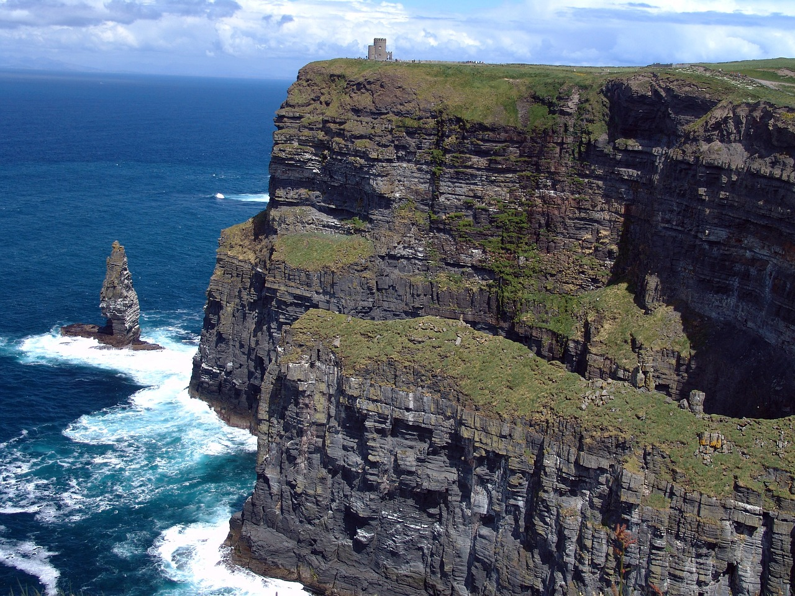
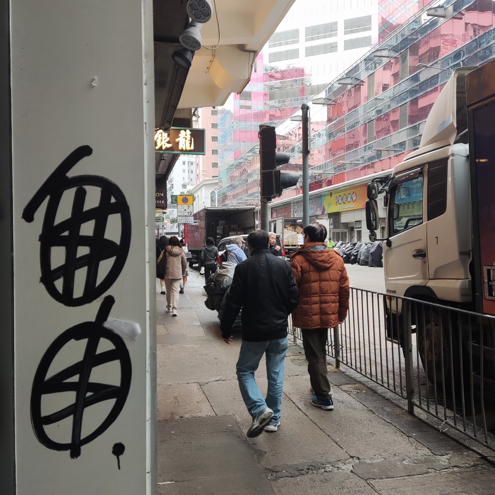
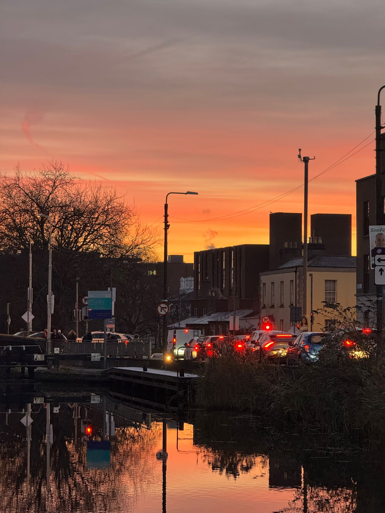

---
# Common-Defined params
title: "【2024】这一年，我狂按人生加速键。"
date: "2024-12-13"
summary: "北京到上海，上海到都柏林，从结婚到移民。我狂按人生加速按钮,终于获得了自由与平静。这一年真的实在是是太酷了！都说三十而立，我在29岁的最后几个月中，完成了35岁之前的目标。一切比想象中的更顺利，比想象中的更完美。愿我们在2025中也一样顺利，落地生根。"

categories:
  - "年终总结"
tags:
  - "年终总结"
  - "2024"
  - "海外生活"
# thumbnail: "img/placeholder.png" # Thumbnail image
lead: "“落叶归根的是肥料和耗材，落叶生根的是种子和希望。”" # Lead text
toc: false
---

# 前言

> “当你离开那片土地，就应该要明白，你要做的不是落叶归根，而是落地生根，落叶归根的是肥料和耗材，落叶生根的是种子和希望。” —— 李显龙
>
> 从北京到上海，从上海到都柏林。我狂按人生加速按钮，终于获得了平静与自由。

# 回望

## 结婚

这可能是我2024年做过最酷的一件事情。

不敢相信，一切这么快，我终于结婚了。

## 移民

差不多就是刚好一年前，2023年的圣诞节。

和女朋友还没有结婚，我出差在香港，女朋友出差在河南，那时候我们工作都非常忙，生活压的我们透不过气。

我们在香港中环的摩天轮上，看到了维多利亚港的圣诞烟花，那一刻，仿佛我们都在生活中长叹一声，得到了一丝喘息和慰藉。

那几天她病了，好像是新冠。那晚的中环超级冷，上海也是，邻居打来电话，说楼道里的消防栓冻裂了，水从二十楼六一直漏到了一楼，我们住二十楼六。打开家里的网络摄像头，一片模糊看不清门口的情况，两只猫还在家里，我们又皱起了眉。

白天，我们在香港街头游荡，那天，我留下了一条坐标在香港的朋友圈。

> “十年前来香港考试。
> 多元，开放，自由，自信，秩序给我带来了极大冲击和震撼。
> 人们在街头，地铁口表达着不同的想法和意见，相互制约，一个社会竟然能这样运转。
> 十年前，旺角铜锣湾，霓虹闪烁，纸醉金迷，一切和想象中，和港剧中的样子一模一样。
> 十年后再度来港，同样给我带来了巨大震撼。
> 不知什么时候开始，香港已经和内地城市相差无几。霓虹灯不见了，地铁口的不同声音不见了，香港的自信也不见了：他们害怕一句口号，一个手势，一首歌曲，一场纪念，一张白纸。
> 这里只剩下了一种声音，因为这是最好的年代。”

我们被这种生活裹挟着，一步也不能停，一步也不能错，我想是时候做一个改变或者了断了。

我们决定，是时候离开这里了，火车头已经掉下悬崖，就没必要等到时候再跳车了。

## 巨变

当时我一定不会想到，2024年的的圣诞节，我们会在欧洲度过，并且这里可能是我未来几年常住，或者永远居住的城市。

我曾经在北京国贸地铁站，看见汹涌的人潮，荡来荡去，憧憬未来。也曾经在上海外滩看见浦东灯光璀璨，浦西的纸醉金迷。但始终有一种对为未来迷茫和焦虑伴随着我们。

我一直以为：去了一线城市就好了，距离文明和自由更近了；落了上海户口就好了，就有归属感了；买了房就好了，就会在这个城市彻底站稳脚了；还完房贷就轻松了，就没那么大压力了；

可是这是结构性的困局，我们逃不掉，身在这个巨大的“绞肉机”之中，如果无法成为这个城市，或者这个国家的既得利益者，没有人能独善其身，保全自己。

我只得狂按加速键，曾经打算在35岁之前，在所谓IT行业年龄危机之前完成移民，现在必须要加快脚步了。

而如你所见，我足够幸运，成功离开了。

倘若不是迈出这一步，我不会早九晚五，规律的生活。

倘若不是迈出这一步，我不会在傍晚的利菲河旁漫步。

倘若不是迈出这一步，我不会和各国的同事在酒吧中，手握Guinness畅谈到午夜零点。

倘若不是迈出这一步，我不会在美丽的悬崖上享受一刻的平静。

倘若不是迈出这一步，我不可能在上班的路上看到这么美的朝霞。

倘若不是迈出这一步，我也无法静下心来，坐在这里，平静的写下着这篇博文。

> 唯自由无价。

# 2025

下一年，希望有如下进步：

- 自由，健康，快乐。
- 英文有所提升。
- 工作能稳定顺利。
- 能持续更新这个博客。
- 买一辆代步车。
- 看更多的书。